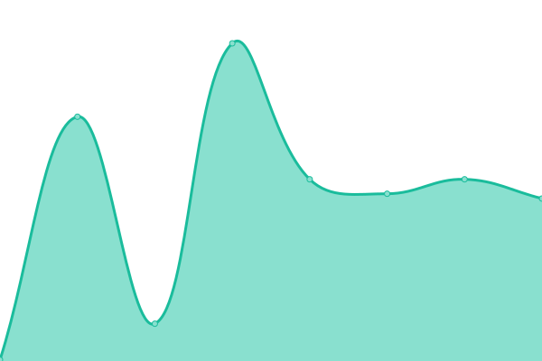

# [📈 Live Status](https://carlitos-ifms.github.io): <!--live status--> **🟧 Partial outage**

This repository contains the open-source uptime monitor and status page for [Carlitos](www.ifms.edu.br), powered by [Upptime](https://github.com/upptime/upptime).

With [Upptime](https://upptime.js.org), you can get your own unlimited and free uptime monitor and status page, powered entirely by a GitHub repository. We use [Issues](https://github.com/carlitos-ifms/uptime/issues) as incident reports, [Actions](https://github.com/carlitos-ifms/uptime/actions) as uptime monitors, and [Pages](https://carlitos-ifms.github.io) for the status page.

<!--start: status pages-->
<!-- This summary is generated by Upptime (https://github.com/upptime/upptime) -->
<!-- Do not edit this manually, your changes will be overwritten -->
<!-- prettier-ignore -->
| URL | Status | History | Response Time | Uptime |
| --- | ------ | ------- | ------------- | ------ |
|  [Site](https://www.ifms.edu.br) | 🟩 Up | [site.yml](https://github.com/carlitos-ifms/uptime/commits/HEAD/history/site.yml) | 

 4405ms
     
 | 

<a href="https://carlitos-ifms.github.io/uptime/history/site">98.03%</a>
    

|  [SUAP](https://suap.ifms.edu.br) | 🟩 Up | [suap.yml](https://github.com/carlitos-ifms/uptime/commits/HEAD/history/suap.yml) | 

 1619ms
     
 | 

<a href="https://carlitos-ifms.github.io/uptime/history/suap">100.00%</a>
    

|  [Sistema Acadêmico (Administrativo)](https://academico.ifms.edu.br/administrativo) | 🟥 Down | [sistema-academico-administrativo.yml](https://github.com/carlitos-ifms/uptime/commits/HEAD/history/sistema-academico-administrativo.yml) | 

 185ms
     
 | 

<a href="https://carlitos-ifms.github.io/uptime/history/sistema-academico-administrativo">0.00%</a>
    

|  [Sistema Acadêmico (Área do Estudante)](https://academico.ifms.edu.br) | 🟥 Down | [sistema-academico-area-do-estudante.yml](https://github.com/carlitos-ifms/uptime/commits/HEAD/history/sistema-academico-area-do-estudante.yml) | 

 10ms
     
 | 

<a href="https://carlitos-ifms.github.io/uptime/history/sistema-academico-area-do-estudante">0.00%</a>
    

|  [Central de Seleção](https://selecao.ifms.edu.br/login) | 🟥 Down | [central-de-selecao.yml](https://github.com/carlitos-ifms/uptime/commits/HEAD/history/central-de-selecao.yml) | 

 159ms
     
 | 

<a href="https://carlitos-ifms.github.io/uptime/history/central-de-selecao">0.00%</a>
    

|  [Moodle (Ead)](https://ead.ifms.edu.br) | 🟩 Up | [moodle-ead.yml](https://github.com/carlitos-ifms/uptime/commits/HEAD/history/moodle-ead.yml) | 

 2807ms
     
 | 

<a href="https://carlitos-ifms.github.io/uptime/history/moodle-ead">100.00%</a>
    

|  [Cursos Livres](https://cursoslivres.ifms.edu.br) | 🟩 Up | [cursos-livres.yml](https://github.com/carlitos-ifms/uptime/commits/HEAD/history/cursos-livres.yml) | 

 1273ms
     
 | 

<a href="https://carlitos-ifms.github.io/uptime/history/cursos-livres">100.00%</a>
    

|  [Matrícula](https://matricula.ifms.edu.br) | 🟩 Up | [matricula.yml](https://github.com/carlitos-ifms/uptime/commits/HEAD/history/matricula.yml) | 

 997ms
     
 | 

<a href="https://carlitos-ifms.github.io/uptime/history/matricula">100.00%</a>
    

|  [Questionário Socioeconômico](https://qse.ifms.edu.br) | 🟩 Up | [questionario-socioeconomico.yml](https://github.com/carlitos-ifms/uptime/commits/HEAD/history/questionario-socioeconomico.yml) | 

 777ms
     
 | 

<a href="https://carlitos-ifms.github.io/uptime/history/questionario-socioeconomico">100.00%</a>
    

|  [Biblioteca](https://biblioteca.ifms.edu.br/pergamum) | 🟥 Down | [biblioteca.yml](https://github.com/carlitos-ifms/uptime/commits/HEAD/history/biblioteca.yml) | 

 0ms
     
 | 

<a href="https://carlitos-ifms.github.io/uptime/history/biblioteca">0.00%</a>
    

|  [Sistemas](http://sistemas.ifms.edu.br) | 🟩 Up | [sistemas.yml](https://github.com/carlitos-ifms/uptime/commits/HEAD/history/sistemas.yml) | 

 950ms
     
 | 

<a href="https://carlitos-ifms.github.io/uptime/history/sistemas">100.00%</a>
    

|  [Verifica](https://verifica.ifms.edu.br/ead/5cdb04be-5f88-4b97-8528-33620a01001c) | 🟩 Up | [verifica.yml](https://github.com/carlitos-ifms/uptime/commits/HEAD/history/verifica.yml) | 

 619ms
     
 | 

<a href="https://carlitos-ifms.github.io/uptime/history/verifica">100.00%</a>
    

|  [Helios](https://helios.ifms.edu.br) | 🟩 Up | [helios.yml](https://github.com/carlitos-ifms/uptime/commits/HEAD/history/helios.yml) | 

 600ms
     
 | 

<a href="https://carlitos-ifms.github.io/uptime/history/helios">100.00%</a>
    

|  [Dados Abertos](http://dados.ifms.edu.br) | 🟩 Up | [dados-abertos.yml](https://github.com/carlitos-ifms/uptime/commits/HEAD/history/dados-abertos.yml) | 

 624ms
     
 | 

<a href="https://carlitos-ifms.github.io/uptime/history/dados-abertos">100.00%</a>
    

|  [Autoavaliação (CPA)](https://autoavaliacao.ifms.edu.br/login) | 🟥 Down | [autoavaliacao-cpa.yml](https://github.com/carlitos-ifms/uptime/commits/HEAD/history/autoavaliacao-cpa.yml) | 

 0ms
     
 | 

<a href="https://carlitos-ifms.github.io/uptime/history/autoavaliacao-cpa">0.00%</a>
    

|  [Avaliação de Desempenho](http://desempenho.ifms.edu.br) | 🟩 Up | [avaliacao-de-desempenho.yml](https://github.com/carlitos-ifms/uptime/commits/HEAD/history/avaliacao-de-desempenho.yml) | 

 583ms
     
 | 

<a href="https://carlitos-ifms.github.io/uptime/history/avaliacao-de-desempenho">100.00%</a>
    

|  [Service Desk (SD)](https://sd.ifms.edu.br) | 🟥 Down | [service-desk-sd.yml](https://github.com/carlitos-ifms/uptime/commits/HEAD/history/service-desk-sd.yml) | 

 75ms
     
 | 

<a href="https://carlitos-ifms.github.io/uptime/history/service-desk-sd">0.00%</a>
    

|  [Portal do Servidor](https://servidor.ifms.edu.br) | 🟩 Up | [portal-do-servidor.yml](https://github.com/carlitos-ifms/uptime/commits/HEAD/history/portal-do-servidor.yml) | 

 1324ms
     
 | 

<a href="https://carlitos-ifms.github.io/uptime/history/portal-do-servidor">100.00%</a>
    

<!--end: status pages-->

[**Visit our status website →**](https://carlitos-ifms.github.io/uptime)

## 📄 License

- Powered by: [Upptime](https://github.com/upptime/upptime)
- Code: [MIT](./LICENSE) © [Carlitos](www.ifms.edu.br)
- Data in the `./history` directory: [Open Database License](https://opendatacommons.org/licenses/odbl/1-0/)
